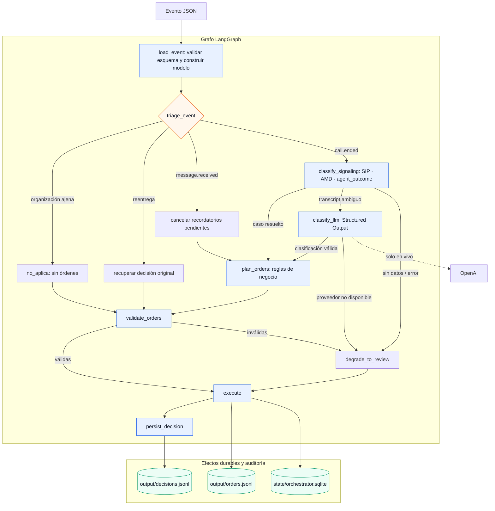

# Call-event orchestrator

Orquestador post-llamada para el reto Kontaktu. Recibe un evento JSON por proceso y
emite una decisión y cero o más órdenes CRM en JSONL. El código de negocio es
determinista; el LLM solo clasifica conversaciones ambiguas.

## Requisitos e instalación

- Python 3.11 o superior.
- Dependencias declaradas en `pyproject.toml`.
- `OPENAI_API_KEY` únicamente para clasificación en vivo.

Con un entorno virtual:

```bash
python -m venv .venv
source .venv/bin/activate       # Windows: .venv\Scripts\activate
python -m pip install -e ".[dev]" pytest
```

La configuración se carga desde `.env.local` y luego `.env` sin sobrescribir variables
que ya existan en el entorno. Para empezar:

```bash
cp .env.example .env.local
```

Variables relevantes:

| Variable | Uso | Valor por defecto |
| --- | --- | --- |
| `KONTAKTU_BASE` | Directorio que contiene `eventos/`, `config/` y `esquemas/` | `./reto-kontaktu` |
| `OFFLINE_REPLAY` | Clasificación determinista de los fixtures locales | `1` |
| `MODEL` | Modelo de OpenAI para clasificación en vivo | `gpt-5.6-luna` |
| `OPENAI_API_KEY` | Credencial requerida si `OFFLINE_REPLAY=0` | — |

## Ejecución

Procesar un evento:

```bash
python run.py reto-kontaktu/eventos/01-call-ended-nuria.json
```

El proceso devuelve código `0` si termina correctamente y `1` si falla. Crea o actualiza:

- `output/decisions.jsonl`: una decisión por evento recibido, incluidas reentregas y
  eventos de otra organización.
- `output/orders.jsonl`: una línea por orden emitida.
- `state/orchestrator.sqlite`: idempotencia y estado durable entre procesos.

La ruta del evento se interpreta desde el directorio actual; `output/` y `state/` siempre se
guardan en la raíz del proyecto. `KONTAKTU_BASE` permite cambiar dónde se buscan `config/` y
`esquemas/`. Los artefactos generados están excluidos de Git.

## Reproducción y verificación

El replay no llama a OpenAI y reconstruye el estado desde cero:

```bash
python tools/replay.py
python tools/check.py
```

`tools/replay.py` elimina únicamente `state/orchestrator.sqlite`,
`output/decisions.jsonl` y `output/orders.jsonl`, procesa los eventos listados en
`reto-kontaktu/eventos/orden.txt` y añade los tres fixtures de `tests/extra_events/`.
`tools/check.py` valida los eventos contra el esquema oficial, los cuerpos de las siete
operaciones CRM, `tests/expected.yaml`, las fechas y ventanas horarias, la idempotencia,
la auditoría y las invariantes del dominio.

Pruebas unitarias:

```bash
python -m pytest -q
```

## Arquitectura y reglas clave



El grafo es un `StateGraph` explícito de LangGraph. Sus responsabilidades están separadas así:

| Área | Responsabilidad |
| --- | --- |
| `src/models/` | Contratos Pydantic de eventos, clasificación y órdenes |
| `src/domain/` | Catálogo de casos, planificación y calendario |
| `src/agents/` | Cliente OpenAI, prompt versionado y Structured Outputs |
| `src/workflows/` | Estado, nodos y rutas condicionales de LangGraph |
| `src/infrastructure/` | SQLite, idempotencia, auditoría y JSONL |

Python resuelve SIP/AMD/`agent_outcome`, precedencia, fechas, reintentos, ventana de
llamadas, DNC, preferencias de canal y órdenes. El clasificador LLM, definido en
`src/agents/call_outcome_classifier/definition.json`, devuelve una etiqueta cerrada,
confianza, motivo y slots opcionales (`callback_day`, `callback_time`, email, etc.); no
calcula fechas ni ejecuta operaciones. Si no hay transcripción, falta la API key o falla la
respuesta estructurada, el flujo degrada a `otro` con una tarea `revisar_llamada` y no
programa contacto saliente.

Toda la aritmética usa `occurred_at` y la zona horaria de `config/campana.yaml`. Las ventanas
son inclusivas; los intentos, recordatorios, bajas, preferencias y cortes repetidos se
persisten en SQLite. Las órdenes tienen claves idempotentes deterministas y se recuperan
líneas JSONL incompletas antes de continuar.

La salida de decisión conserva los campos oficiales y añade `razonamiento` (resumen auditable
de señales y acciones) y `evento` (copia completa del payload validado), para poder revisar
el resultado sin volver a cargar la entrada.

## Alcance

No hay servidor, cola ni CRM remoto: “ejecutar” una orden significa escribirla en
`output/orders.jsonl` y aplicar su efecto durable local. Tampoco se usa una base de datos
externa; SQLite es suficiente para la idempotencia exigida por el reto. Se evita llamar al
LLM cuando las señales fiables ya resuelven el caso, reduciendo coste y latencia y haciendo
el replay reproducible. El prompt utilizado está versionado en
`prompts/classification_v1.md` y sus cambios en `prompts/CHANGELOG.md`.

Para inspeccionar los JSONL generados visualmente, abre `visor/index.html` y selecciona la
carpeta `output/`.
